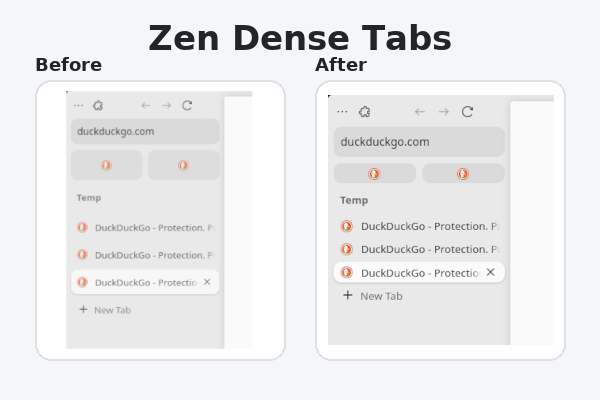

# Zen Dense Tabs

A [Zen-Browser](https://zen-browser.app/) mod that makes your tabs more compact — reducing vertical space for a denser, efficient layout.

## ✨ Features
- Shrinks tab and workspace heights using Zen’s built-in CSS variables.
- Keeps alignment consistent for icons and labels.
- Lightweight, simple, and compatible with all Zen layouts.

## 🛒 Install
Available on the [Zen Mod Store](https://zen-browser.app/mods) — search for **Dense Tabs** and click **Install**.

## 🧩 Compatibility
Developed and Testen on
Zen Browser
1.16b (Firefox 143.0.1) (64-bit)

## Mod GitHub Page
[Visit Mod Page](https://github.com/Bischtinius/zen-dense-tabs)

## 📄 License
[MIT](LICENSE) © Bischtinius
